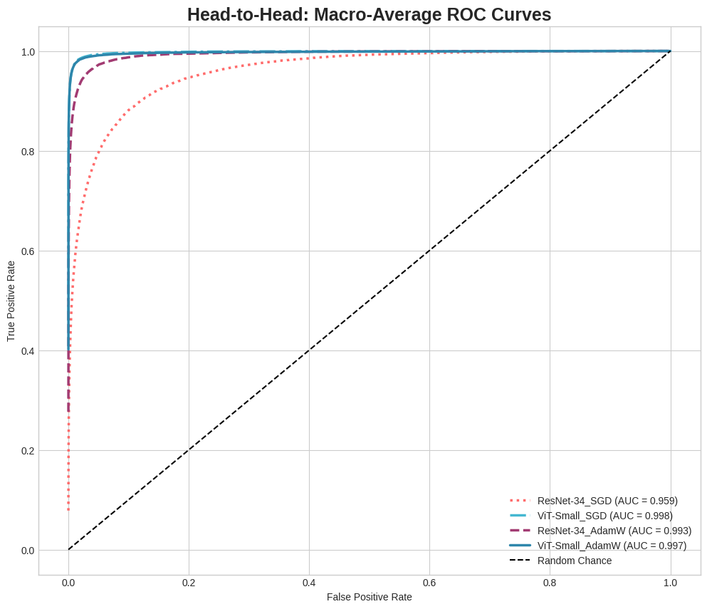
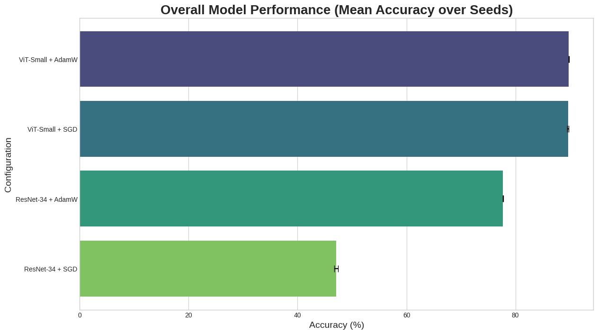

# Fair Architectural Comparison: ViT vs ResNet
[](LICENSE)
[]()
> A reproducible, bias-controlled framework for evaluating architectural inductive biases — designed as a clean foundation for future neural-alignment studies.

## Overview

This project presents a rigorous, reproducible comparison between a Vision Transformer (ViT-Small) and a Convolutional Network (ResNet-34) on the Food-101 dataset.
The project aims to minimize experimental confounds often present in ML literature, offering a clean, reproducible baseline for architectural comparisons that can later be extended toward neural-alignment research.

## Motivation

Inspired by [DiCarlo Lab's 2025 ICLR work](https://arxiv.org/abs/2412.09115) on spatial latent learning and ventral-stream modeling, this study explored how different architectures capture spatial structure in vision — a question that resonates deeply with me.
I wanted to examine, at a purely computational level, how two commonly compared architectures (ViT and ResNet) behave when all other experimental variables are held constant.
I understand that classification accuracy alone does not address neural alignment — the central question of the DiCarlo Lab’s work. This project is meant to be a starting point — a clean, transparent computational baseline for architectural comparisons that could eventually connect to biological neural alignment studies.

**On confounds in ML research:** Recent reviews and commentaries have highlighted recurring methodological confounds in machine learning research — e.g., hidden implementation/engineering biases, selective hyperparameter tuning, insufficient seeds/reporting, dataset leakage, and narrow evaluation practices — which can misattribute performance gains to architecture rather than experimental choices. To address these concerns I designed this framework to enforce identical data pipelines and hyperparameters, match parameter counts, run multiple random seeds, perform optimizer ablations, and report paired statistical tests and compute metrics (see code and METHODOLOGY.md). *(Pineau et al., 2021; Li et al., 2019; Semmelrock et al., 2023; Sculley et al., 2015; Bin Yu, 2024).* These controls make the comparison a 'fairer' reflection of architectural inductive biases rather than training or implementation differences — an essential step before studying alignment with biological vision systems.

## Key Features

- ✅ **Identical augmentation** for both architectures (no favoritism)
- ✅ **Parameter matching** (~22M parameters)
- ✅ **Statistical robustness** (N = 5 random seeds)
- ✅ **Optimizer ablation** (AdamW vs SGD for both models)
- ✅ **Paired statistical tests** (*t*-test + Wilcoxon + Cohen’s *d*)
- ✅ **Full reproducibility** (seeded dataloaders, deterministic training)
- ✅ **Computational metrics** (FLOPs, training time)

## Results Summary

| Model | Optimizer | Mean Accuracy | Std Dev | 
|-------|-----------|---------------|---------|
| ViT-Small | SGD | **90.05%** | ±0.12% |
| ResNet-34 | AdamW | 77.72% | ±0.27% |
| ResNet-34 | SGD | 46.69% | ±0.23% |

**Statistical significance:** *p* < 0.0001 (paired *t*-test), Cohen's *d* = 65.2




**Key finding:** ViT demonstrates robust performance across optimizers, while ResNet shows optimizer sensitivity (non-convergence under SGD).

## Requirements

### Software
- Python 3.8+
- PyTorch 1.12+
- CUDA 11.0+ (recommended)

### Installation
```bash
# Create virtual environment
python -m venv venv
source venv/bin/activate  # On Windows: venv\Scripts\activate

# Install dependencies
pip install -r requirements.txt

# Download Food-101 dataset (automatic on first run)
```

## Usage

### Quick Start
```bash
python comparison.py
```

Results will be saved to `results/` directory.

### Advanced Usage
```python
# Modify configuration in comparison.py
class Config:
    SEEDS = [42, 101, 1337, 2024, 888]   # Change seeds
    NUM_EPOCHS = 10                      # Adjust training duration
    BATCH_SIZE = 512                     # Adjust as per GPU
```

### Analyze Results
```bash
python analysis.py --results_dir results/
```

## Project Structure
```
dicarlo_fair_comparison/
├── README.md             # Project overview
├── METHODOLOGY.md        # Detailed experimental methods
├── RESULTS.md            # Extended results
├── models/               # Fine tuned models saved (Currently this has saved models for seed 42 and seed 101). These are just for reference and may be deleted before starting the experiment
├── comparison.py         # Main training script
├── analysis.py    # Statistical analysis
├── requirements.txt      # Dependencies
└── figures/              # Visualizations

```

## Methodology Highlights

### Fair Comparison Protocol

1. **Identical Data Pipeline**
   - Same augmentation: TrivialAugmentWide + Resize(224)
   - Same normalization: ImageNet statistics
   - Same train/test splits

2. **Matched Architectures**
   - ViT-Small: 22.05M parameters
   - ResNet-34: 21.80M parameters
   - Difference: <2%

3. **Optimizer Ablation**
   - Both models tested with AdamW and SGD
   - Identical hyperparameters per optimizer
   - No cherry-picking

4. **Statistical Rigor**
   - 5 random seeds (total 20 runs)
   - Paired statistical tests
   - Effect size reporting included

## Reproducibility

All experiments use deterministic settings:
- Fixed random seeds
- Deterministic CUDA operations
- Seeded dataloader workers
- Version-pinned dependencies

To reproduce this experiment:
```bash
python comparison.py --seed 42
```

## Extending to Neural Alignment

This computational baseline can be extended to neural alignment studies following DiCarlo Lab's methodology:

1. **Spatial Latent Prediction**: Add rotation/scale/position prediction heads
2. **Representational Similarity**: Compute RDM correlation with neural data
3. **Brain-Score Evaluation**: Test for IT cortex predictivity

See `METHODOLOGY.md` for implementation details.

## Limitations

- **Dataset**: Evaluated on a single dataset (Food-101); future work will include multiple datasets for generalization.
- **Architectures**: Tested only two architectures; broader comparisons are planned.
- **Neural alignment**: This is a purely computational baseline — no neural data yet.
- **Training duration**: 10 epochs; longer training may improve ResNet+SGD

## Citation

```bibtex
@software{Ambar-vit-resnet-comparison,
  author       = {Ambar},
  title        = {Fair Architectural Comparison Framework for Vision Models},
  institution  = {National University of Singapore},
  year         = {2025},
  month        = {October},
  url          = {https://github.com/Ambar-13/fair-vit-resnet-comparison},
  note         = {Version 1.0},
}
```

And cite the original DiCarlo Lab work:
```bibtex
@inproceedings{xie2025spatial,
  title={Vision CNNs trained to estimate spatial latents learned similar ventral-stream-aligned representations},
  author={Xie, Yudi and others},
  booktitle={ICLR},
  year={2025}
}
```
```bibtex
@article{pineau2021improving,
  title     = {Improving Reproducibility in Machine Learning Research: A Report from the NeurIPS 2019 Reproducibility Program},
  author    = {Pineau, Joelle and Vincent-Lamarre, Philippe and Sinha, Koustuv and Larivi{\`e}re, Vincent and Beygelzimer, Alina and d'Alch{\'e}-Buc, Florence and Fox, Emily and Larochelle, Hugo},
  journal   = {Journal of Machine Learning Research},
  volume    = {22},
  number    = {164},
  pages     = {1--20},
  year      = {2021},
  doi       = {10.48550/arXiv.2003.12206},
  url       = {https://jmlr.org/papers/v22/20-303.html},
  note      = {Report from the NeurIPS 2019 reproducibility initiative}
}

@techreport{li2019challenges,
  title     = {Challenges and Pitfalls of Machine Learning Evaluation and Benchmarking},
  author    = {Li, Cheng and Dakkak, Abdul and Xiong, Jinjun and Hwu, Wen-mei W.},
  institution = {University of Illinois at Urbana-Champaign},
  year      = {2019},
  doi       = {10.48550/arXiv.1904.12437},
  url       = {https://arxiv.org/abs/1904.12437},
  note      = {Discusses evaluation and benchmarking pitfalls, leakage, and reproducibility}
}

@article{semmelrock2023reproducibility,
  title     = {Reproducibility in Machine Learning-Driven Research: Overview, Barriers, and Drivers},
  author    = {Semmelrock, Harald and Kopeinik, Simone and Theiler, Dieter and Ross-Hellauer, Tony and Kowald, Dominik},
  journal   = {arXiv preprint},
  year      = {2023},
  doi       = {10.48550/arXiv.2307.10320},
  url       = {https://arxiv.org/abs/2307.10320},
  note      = {Mini-survey reviewing reproducibility challenges across ML-driven research}
}

@inproceedings{sculley2015hidden,
  title     = {Hidden Technical Debt in Machine Learning Systems},
  author    = {Sculley, Daniel and Holt, Gary and Golovin, Daniel and Davydov, Eugene and Phillips, Todd and Ebner, Ankur and Chaudhary, Vinay and Young, Michael and Crespo, Jared and Dennison, Dan},
  booktitle = {Advances in Neural Information Processing Systems (NeurIPS)},
  year      = {2015},
  url       = {https://papers.nips.cc/paper/2015/hash/5656-hidden-technical-debt-in-machine-learning-systems-abstract.html},
  note      = {Seminal paper on engineering confounds and ML system biases}
}

@article{yu2024after,
  title     = {After Computational Reproducibility: Scientific Reproducibility and Trustworthy AI},
  author    = {Yu, Bin},
  journal   = {Harvard Data Science Review},
  publisher = {MIT Press},
  year      = {2024},
  doi       = {10.1162/99608f92.36c833d9},
  url       = {https://hdsr.mitpress.mit.edu/pub/after-computational-reproducibility},
  note      = {Perspective on reproducibility and veridical data science}
}
```
## Acknowledgments

This work was inspired by Professor James DiCarlo’s research on the ventral visual stream and computational neuroscience.
I’m deeply grateful to the DiCarlo Lab for their pioneering work on neural alignment — it continues to be a major source of motivation for me.

## Contact

For questions or collaboration:
- **Email:** [ambar13@u.nus.edu]
- **GitHub:** [github.com/Ambar-13]
- **Institution:** National University of Singapore

## License

MIT License - See LICENSE file for details.

---

**Note:** This independent student project was developed out of genuine curiosity about neural alignment and as an educational exploration that may contribute to future research in computational neuroscience and machine learning at large.
